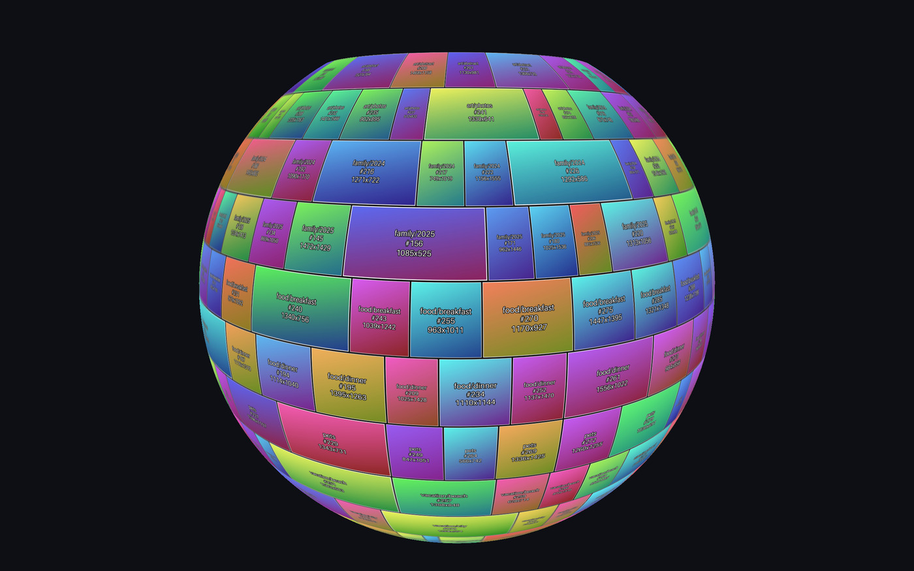
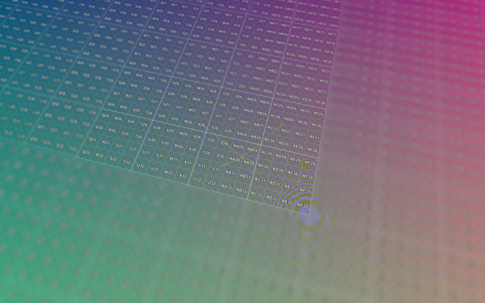
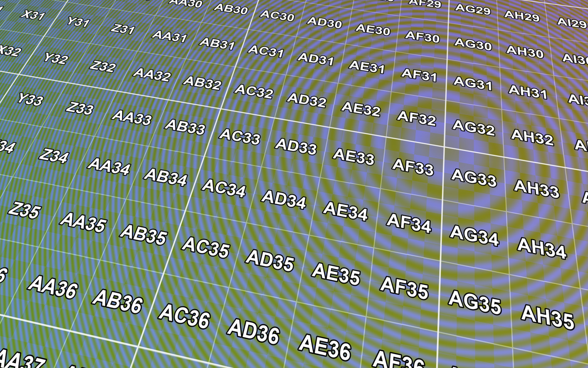

# big-picture — virtual texturing viewers for giant images

Explore multi-gigapixel images in real time while the GPU only ever holds a
single 4096² texture. A MegaTexture / LibVT-style virtual texturing renderer,
in Python (OpenGL 3.3) and C (SDL2 + OpenGL ES 2.0).


*A folder tree of images mosaicked into one giant picture and wrapped onto a
globe — 300 images, 50 megapixels, of which only 87 of the atlas's 225 pages
were resident when this frame was drawn.*


*The 16384² synthetic test image, orbited at 1155 fps. The title bar tracks
resident pages, pending loads, and tiles streamed.*

## Build

Python viewers — that's all you need to get running:

```sh
pip install -r requirements.txt
```

The C viewers are optional, and need SDL2 plus the ANGLE GLES2 libraries from
[opengl-for-mac](https://github.com/erik-larsen/opengl-for-mac):

```sh
brew install sdl2
git clone https://github.com/erik-larsen/opengl-for-mac.git ~/Github/opengl-for-mac
cd c && OGL_FOR_MAC=~/Github/opengl-for-mac ./build_mac.sh
```

## Run

Always two steps: build a tiled pyramid, then point a viewer at it.

**A synthetic test image**, if you have no images handy:

```sh
./gen_test_image.py     # 16384² test pattern (805 MB .npy)
./build_pyramid.py      # -> test_image_16k_pyramid/
./vt_viewer.py          # orbit it
```

**Your own folder of photos** — any nesting; subfolders stay grouped:

```sh
./layout_mosaic.py ~/Pictures/some_tree      # -> some_tree_mosaic.npy
./build_pyramid.py some_tree_mosaic.npy
./vt_viewer.py        some_tree_mosaic_pyramid   # flat
./vt_sphere_viewer.py some_tree_mosaic_pyramid   # globe
```

Add `--aspect 3:1` to `layout_mosaic.py` for a mosaic that wraps the globe a
full 360°, and `--inside` to the sphere viewer to stand at the centre and look
out. The C viewers take the same arguments:

```sh
cd c && ./vt_viewer ../test_image_16k_pyramid
```


*The same virtual-texturing core on a sphere band — only the geometry differs.*

## Controls

| input | action |
| --- | --- |
| drag | orbit (flat) / look around (sphere) |
| right-drag, shift-drag | pan (flat viewer) |
| scroll | zoom |
| hover | outline the mosaic image under the pointer |
| click | centre the view on that image, eased |
| **H** | cycle hover-highlight style |
| **F** | freeze / unfreeze streaming |
| **L** | LOD debug overlay |
| **R**, **ESC** | reset view, quit |

Freezing is the one worth trying first: it pins the working set, evicts every
page the frozen view doesn't need, and draws the freeze-moment frustum. Fly
away and the algorithm is laid bare.


*After **F** close-in, then pulling back: only the 49 of 225 pages the frozen
view needed survive, so its footprint stays sharp while everything else falls
back to the coarsest resident ancestor.*

Every viewer also runs headless for self-tests:
`--frames N --screenshot out.png` flies a scripted path, waits for streaming to
settle, and saves the frame.

---

## Implementation

### Pipeline

| script | does |
| --- | --- |
| `gen_test_image.py` | 16384² pattern: **R** = U, **G** = V, **B** = checkerboard + zone plate (a radial chirp — the classic aliasing test), with every 256px cell labelled `A1`-style so you always know where you are. |
| `layout_mosaic.py` | Folder tree → one giant mosaic, justified rows (each row spans the full width, aspect preserved). Auto-sizes the canvas so images land at ~native resolution. Writes a `layout.json` of every image's rectangle. `--aspect`, `--width`, `--gap`. |
| `build_pyramid.py` | Any rectangular `.npy` → tile pyramid, L0 = full res up to a single root tile (7 levels / 5461 tiles for the test image). Partial edge tiles are edge-padded. `--format jpg` for smaller tiles. |
| `export_dzi.py` | Pyramid → Deep Zoom, viewable in OpenSeadragon in a browser. Re-crops to DZI's edge-tile convention, flips the level numbering, and writes `image.dzi` + a ready `viewer.html`. |

Output names derive from inputs: `<folder>_mosaic.npy` → `<stem>_pyramid/`.

### How the virtual texturing works

* **Physical atlas** — one 4096² texture holding 15×15 = 225 slots of 260².
  Only ~15 Mtexels are ever on the GPU, versus 268 Mtexels for the full 16k
  image.
* **Tile borders** — each tile is 256² of payload plus a 2px skirt baked from
  its neighbours (hence 260², not 256²), so bilinear filtering never samples
  across into an unrelated atlas neighbour.
* **Page table** — one texel per virtual page → (atlas slot x, slot y, resident
  level). Non-resident pages inherit their finest loaded ancestor, so sampling
  always succeeds and detail refines progressively instead of popping in.
* **Feedback pass** — each frame the scene re-renders into a ~256×160 buffer
  whose shader emits (pageX, pageY, LOD) per pixel; reading it back gives the
  exact working set, with no guessing about what's visible.
* **Streaming** — a background thread decodes tiles coarsest-first; uploads are
  budgeted at 24/frame to avoid hitches; LRU reclaims slots when the atlas
  fills. The root tile is pinned so the fallback chain always terminates.
* **Sampling** — the fragment shader derives LOD from UV derivatives and blends
  two page-table levels (manual trilinear) to hide level seams and popping.


*At native resolution: crisp glyph edges and zone-plate rings, no visible seams
where tiles meet — the baked borders doing their job.*

### Hover highlight

The outline is drawn in the **fragment shader**, not as geometry. The hovered
rect is a signed distance field in UV space; dividing it by its own
screen-space gradient (`dFdx`/`dFdy`) converts it to pixels, so one uniform
yields a constant-width outline at any zoom — and it follows the sphere's
curvature for free, since the derivatives already encode the bend.

A plain coloured line isn't robust: yellow vanishes on a yellow photo, and pure
inversion (`1 - dst`, the classic XOR rubber band) disappears against mid-grey.
**H** cycles the alternatives:

| # | style | trade-off |
| --- | --- | --- |
| 1 | flat yellow | the naive baseline — fails on yellow content |
| 2 | **yellow core + dark halo** *(default)* | dual-contour: one of the two always contrasts, and the hue still reads as "selected" |
| 3 | contrast-adaptive core | black or white per pixel by local luminance; neutral, but can shimmer along a busy edge |
| 4 | adaptive + scrim | also dims everything outside — unmistakable, but restyles the whole image |
| 5 | marching ants | animated dashes; motion is the strongest cue, at the cost of noise |

### C port

`c/vt_core.c` holds the shared system (streaming thread, atlas, page table,
shaders, manifest); the two front-ends add geometry, camera, and input. GLES2
has no texture arrays, no `texelFetch`, and no integer GLSL ops, so the
per-level page tables pack into one 2D texture and the feedback pass encodes
page IDs with `mod`/`floor` arithmetic — which incidentally leaves the shaders
WebGL1-compatible. Tiles decode via vendored `stb_image.h`. `build_mac.sh`
rewrites ANGLE's cwd-relative dylib install names to absolute paths, so no
`DYLD_FALLBACK_LIBRARY_PATH` is needed at runtime.
