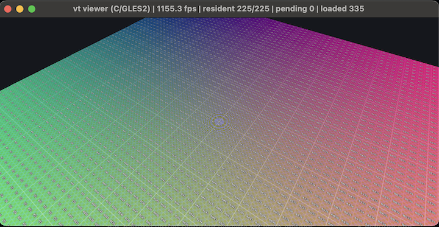

# big-picture — virtual texturing viewers for giant images




A pipeline for viewing giant images in OpenGL through a custom
virtual-texturing (MegaTexture / LibVT-style) renderer: synthesize a
16384×16384 test image *or* mosaic a folder tree of photos into a 16:9
giant image, tile it into a pyramid, and orbit it.

## Setup

```sh
pip install -r requirements.txt
```

## 1. `gen_test_image.py`

Writes `test_image_16k.npy` (805 MB memmap, low peak RAM) plus a 2048²
preview PNG. Pattern: **R = U**, **G = V**, **B = 64px checkerboard + zone
plate** (radial chirp — the classic aliasing/mip-filter test), with the
256px tile grid and brighter 1024px grid overlaid.

## 1b. `layout_mosaic.py` — folder tree → 16:9 mosaic

```sh
python layout_mosaic.py ~/Pictures/some_tree
python build_pyramid.py --src some_tree_mosaic.npy
python vt_viewer.py --pyramid some_tree_mosaic_pyramid
```

Output names derive from the input when `--out` is omitted:
`<folder>_mosaic.npy` (+ `_preview.png`, `_layout.json`), and
`build_pyramid.py` writes `<src stem>_pyramid/`.

Recursively gathers images (sorted by path, so folders stay grouped) and
places them with a justified-rows layout — every row spans the full canvas
width, each image keeps its aspect ratio, and the row height is solved so
the rows fill a 16:9 canvas. The canvas is auto-sized so every image fits
at ~its native resolution (rounded up to a 256px multiple, capped at
4096 tiles = 1048576px per axis — the viewer's feedback pass packs page
coordinates in 12 bits; disk runs out well before that). Writes the
mosaic `.npy`, a preview PNG, and a `layout.json`
manifest of every image's rectangle. Options: `--width` (override the
auto size), `--gap` (pixel gap between images), `--aspect` (canvas
aspect as `W:H` or a float, default `16:9` — e.g. `--aspect 3:1` makes
a mosaic that wraps the sphere viewer's full 360°).

## 2. `build_pyramid.py`

Tiles any rectangular `(H, W, 3)` uint8 `.npy` into a pyramid: L0 = full
res … Lmax = a single tile (7 levels / 5461 tiles for the square test
image, 7 levels / 3081 tiles for the 16:9 mosaic). Dimensions that stop
dividing evenly are handled as partial edge tiles, padded by edge
replication. Each tile is 256² payload plus a **2px border skirt** baked
from its neighbors, so the renderer can bilinear-filter anywhere inside a
tile without seams (that skirt is why stored tiles are 260², not 256²).
`--format jpg` for smaller tiles.

## 3. `vt_viewer.py`

```sh
python vt_viewer.py                 # interactive orbit
python vt_viewer.py --frames 240 --screenshot out.png   # self-test
```

Drag = orbit, right-drag/shift-drag = pan, scroll = zoom, click = zoom
+50% toward the point under the cursor, **F** = freeze/unfreeze
streaming — freezing pins the current working set: every resident page
the frozen view doesn't need is evicted (only its tiles + the root
survive), and the freeze-moment view frustum is drawn as a yellow
depth-tested wireframe. Fly around and the algorithm is laid bare:
sharp tiles exactly inside the frustum's footprint, graded coarser with
distance, root-level blur beyond; unfreeze to watch refinement stream
back in. **L** = LOD debug overlay, **R** = reset, **ESC** = quit. Same
keys in the sphere viewer and the C ports.

## 3b. `vt_sphere_viewer.py` — the mosaic on a sphere band

```sh
python vt_sphere_viewer.py --pyramid LandWaterSkyScapes_mosaic_pyramid
```

Wraps the mosaic equirectangularly onto a sphere band: latitude ±60°,
longitude span derived from the image aspect for a distortion-free
equator (16:9 → ±106.7°; capped at 360°). By default the band is on the
**outside** of the sphere (globe-style) with the camera orbiting it and
scroll changing height above the surface; `--inside` puts the camera at
the sphere's center looking out (panorama-style, scroll = FOV). Drag
pans azimuth/elevation with trackball inertia — fling and it keeps
spinning with exponential damping; after ~5s of no input a slow
auto-rotate kicks in (continuous on a full-wrap band, ping-pong
otherwise; `--idle-delay`/`--idle-speed`, `--idle-delay 0` disables).
Clicking finds the image under the cursor in the mosaic's `layout.json`
and glides the camera (ease-in/out) to center it while zooming +50%; the
window title shows the clicked file's name. Same virtual-texturing core
as `vt_viewer.py` — only geometry/camera differ.

## 3c. `c/` — C / SDL2 / GLES2 ports of both viewers

```sh
cd c && OGL_FOR_MAC=~/Github/opengl-for-mac ./build_mac.sh
./vt_viewer --pyramid ../test_image_16k_pyramid
./vt_sphere_viewer --pyramid ../test_tree_mosaic_pyramid [--inside]
```

Native ports of `vt_viewer.py` and `vt_sphere_viewer.py` on SDL2 +
OpenGL ES 2.0 (ANGLE, via
[opengl-for-mac](https://github.com/erik-larsen/opengl-for-mac)):
`vt_core.c/h` holds the shared VT system (streaming loader thread,
atlas, page table, shaders), the two `vt_*.c` front-ends the geometry,
cameras, and input (same controls, click-zoom easing, inertia, idle
spin, and `--frames/--screenshot` self-tests as the Python versions).
GLES2 lacks texture arrays / `texelFetch` / integer GLSL ops, so the
per-level page tables pack into one 2D texture (per-level rects in a
uniform array) and the feedback pass encodes page IDs with mod/floor
arithmetic — which incidentally makes the shaders WebGL1-compatible.
Tiles decode via vendored `stb_image.h`. The build script rewrites the
ANGLE dylibs' cwd-relative install names to absolute paths and points
SDL at them, so no `DYLD_FALLBACK_LIBRARY_PATH` is needed.

## 4. `export_dzi.py` — pyramid → Deep Zoom (OpenSeadragon)

```sh
python export_dzi.py --pyramid test_image_16k_pyramid
python3 -m http.server        # then open http://localhost:8000/test_image_16k_pyramid_dzi/viewer.html
```

The pyramid is already ~95% of a Deep Zoom dataset; this re-crops each
tile to DZI's edge-tile conventions (edge tiles carry overlap only on
sides with neighbors), flips the level numbering (DZI level N = full res,
level 0 = 1×1 px) and tile naming (`col_row`), synthesizes the sub-256px
levels from the root tile, and writes `image.dzi` + `viewer.html` (uses
OpenSeadragon from CDN).

How the virtual texturing works:

* **Physical atlas** — one 4096² RGB texture holding 15×15 = 225 tile
  slots of 260² (payload + border). Only these ~15 Mtexels are ever on the
  GPU, versus 268 Mtexels for the full image.
* **Page table** — an RGBA8 texture *array* with one layer per pyramid
  level (an array rather than a mip chain, so non-square page grids with
  partial edge tiles work); each texel maps a virtual page to (atlas slot
  x, atlas slot y, resident level). Non-resident pages inherit their
  finest loaded ancestor's entry, so sampling always succeeds and detail
  refines progressively as tiles stream in.
* **Feedback pass** — each frame the scene is re-rendered into a ~256×160
  offscreen buffer whose shader emits (pageX, pageY, LOD) per pixel; a CPU
  readback of that buffer yields the exact working set to request.
* **Streaming** — a background thread decodes tiles (coarse levels first);
  uploads are budgeted per frame (24) to avoid hitches; LRU eviction
  reclaims slots when the atlas is full (the root tile is never evicted).
* **Sampling** — the fragment shader derives LOD from UV derivatives,
  fetches the page-table entry via `texelFetch`, remaps into the atlas,
  and blends two adjacent levels (manual trilinear) to hide LOD popping
  and seams.
