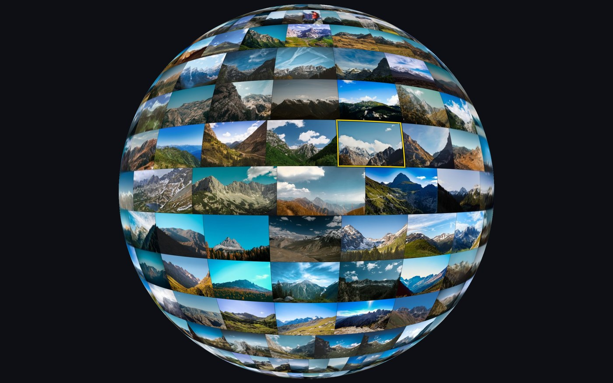
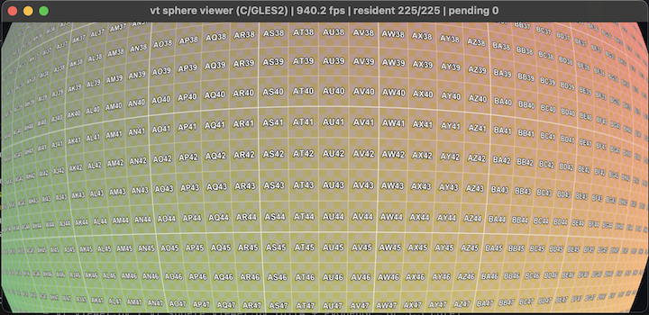

# big-picture

Explore multi-gigapixel images and image collections in real time while the GPU only ever holds a
single 4096² texture. A MegaTexture / LibVT-style virtual texturing renderer,
in Python (OpenGL 3.3) and C (SDL2 + OpenGL ES 2.0) — and the C version
compiled to WebAssembly, so it runs in a browser too.

**[Try the globe in your browser →](https://erik-larsen.github.io/big-picture/)**


*445 mountain photographs mosaicked into a single 1.7 gigapixel image and
wrapped onto a globe. Just 92 of the atlas's 225 pages were resident when
this frame was drawn — reproduce it with the commands below.*


*The 16384² synthetic test image, orbited at 1155 fps. The title bar tracks
resident pages, pending loads, and tiles streamed.*

## Build

Python viewers — that's all you need to get running:

```sh
pip install -r requirements.txt
```

The C viewers are optional, and need SDL2 plus the ANGLE GLES2 libraries from
[opengl-for-mac](https://github.com/erik-larsen/opengl-for-mac):

```sh
brew install sdl2
git clone https://github.com/erik-larsen/opengl-for-mac.git ~/Github/opengl-for-mac
cd c && OGL_FOR_MAC=~/Github/opengl-for-mac ./build_mac.sh
```

The web build needs [emsdk](https://emscripten.org/docs/getting_started/downloads.html);
it pulls in SDL2 by itself:

```sh
source ~/Github/emsdk/emsdk_env.sh
cd c && ./build_web.sh     # -> web/vt_sphere_viewer.{js,wasm}
```

## Run

Always two steps: build a tiled pyramid, then point a viewer at it.

**A synthetic test image**, if you have no images handy:

```sh
./gen_test_image_16k.py   # 16384² test pattern -> pics/test_image_16k.npy
./build_pyramid.py        # -> pics/test_image_16k_pyramid/
./vt_viewer.py            # orbit it
```

**A synthetic photo collection**, if you want to exercise the mosaic path
without an API key or your own pictures:

```sh
./gen_test_image_tree.py   # 300 labelled cards -> pics/phototree/
./layout_mosaic.py pics/phototree --aspect 3:1
./build_pyramid.py pics/phototree_mosaic.npy
./vt_sphere_viewer.py pics/phototree_mosaic_pyramid
```


*The same globe built from 300 generated cards instead of photographs.*

Each card is labelled with its folder path, so the globe doubles as a
readable map of what the layout algorithm did. Same `--seed` and `--count`
always rebuild the same tree.

**Real photographs** — a concrete, non-synthetic example. It needs a free
API key, which takes about a minute to get:

1. Sign in or create a free account at
   [pexels.com/api](https://www.pexels.com/api/).
2. On that page click **Get Started** and say briefly what you are building.
3. Copy the key from your API dashboard.

```sh
export PEXELS_API_KEY=your_key_here
./fetch_photos.py --source pexels --count 1024 --query mountains --width 2400 --budget-mb 250
./layout_mosaic.py pics/photos_mountains --aspect 3:1
./build_pyramid.py pics/photos_mountains_mosaic.npy
./vt_sphere_viewer.py pics/photos_mountains_mosaic_pyramid
```

`--budget-mb` stops the download once it has 250 MB on disk, so at 2400px
that lands around 445 photographs rather than the full 1024 — a **1.7
gigapixel** mosaic (71936×23979), wrapped into a full 360° globe. Pick any
`--query` you like. `CREDITS.md` is written beside the photos, crediting
every photographer.

`--source unsplash` and `--source pixabay` work the same way, reading
`UNSPLASH_ACCESS_KEY` or `PIXABAY_API_KEY` instead.

At a fixed byte budget the total pixel count is roughly constant however you
split it, so `--count` against `--width` is really a choice between a denser
mosaic and deeper zoom into any one photo. 2400px is the deep-zoom end: a
single photograph fills the window at native resolution.

The photographs themselves are not committed — they are one command away,
and would otherwise weigh on every clone forever.

**Your own folder of photos** — any nesting; subfolders stay grouped:

```sh
./layout_mosaic.py ~/Pictures/some_tree      # -> ~/Pictures/some_tree_mosaic.npy
./build_pyramid.py ~/Pictures/some_tree_mosaic.npy
./vt_viewer.py        ~/Pictures/some_tree_mosaic_pyramid   # flat
./vt_sphere_viewer.py ~/Pictures/some_tree_mosaic_pyramid   # globe
```

Add `--aspect 3:1` to `layout_mosaic.py` for a mosaic that wraps the globe a
full 360°, and `--inside` to the sphere viewer to stand at the centre and look
out. The C viewers take the same arguments:

```sh
cd c && ./vt_viewer ../pics/test_image_16k_pyramid
```

**In a browser** — the same pipeline, with JPEG tiles and one packaging
step. `export_web.py` gathers the tiles, `meta.json`, the layout, and a
credit for every photo into one folder a static web server can host:

```sh
./build_pyramid.py pics/photos_mountains_mosaic.npy --format jpg --quality 80
./export_web.py pics/photos_mountains_mosaic_pyramid   # -> pics/photos_mountains_mosaic_web/
ln -s ../pics/photos_mountains_mosaic_web web/tiles
python3 -m http.server -d web                          # http://localhost:8000
```

The page looks for `tiles/` beside itself; `?tiles=URL` points it anywhere
else. The live demo publishes `web/` from this repo with GitHub Actions
(`.github/workflows/pages.yml`), and the tiles from their own repo,
[big-picture-tiles](https://github.com/erik-larsen/big-picture-tiles), so
that they don't weigh on every clone of the code. To republish them, export
straight into a checkout of that repo and replace its single commit:

```sh
./export_web.py pics/photos_mountains_mosaic_pyramid --out ../big-picture-tiles
cd ../big-picture-tiles && git checkout --orphan new && git add -A \
    && git commit -qm "Tiles" && git branch -M new main && git push -f origin main
```


*The same virtual-texturing core on a sphere band — only the geometry differs.*

## Controls

| input | action |
| --- | --- |
| drag | orbit (flat) / look around (sphere) |
| right-drag, shift-drag | pan (flat viewer) |
| scroll | zoom |
| hover | outline the mosaic image under the pointer |
| click | centre the view on that image, eased |
| double click | zoom until that image fills the window (sphere viewer) |
| **H** | cycle hover-highlight style |
| **F** | freeze / unfreeze streaming |
| **L** | LOD debug overlay |
| **R**, **ESC** | reset view, quit |

Zooming in gradually **de-warps** the globe: once it fills the window, the
surface eases from sphere to the plane tangent at whatever the camera is
looking at, so by the time a picture fills the window it is flat and in its
true aspect ratio — the equirectangular squeeze undone along the way. Zoom back out and it eases
back into a sphere. It is one continuous morph, not a mode switch; double
click drives it straight to the flat end, landing square on that photo.

The sphere viewer opens in an attract spin — a slow auto-rotate that stops
for good the moment you touch the view, and comes back on **R**
(`--idle-delay 0` disables it). The hover outline tracks the camera, not
just the pointer, so it keeps up while the globe spins or glides.

Freezing is the one worth trying first: it pins the working set, evicts every
page the frozen view doesn't need, and draws the freeze-moment frustum. Fly
away and the algorithm is laid bare.


*After **F** close-in, then pulling back: only the 49 of 225 pages the frozen
view needed survive, so its footprint stays sharp while everything else falls
back to the coarsest resident ancestor.*

Every viewer also runs headless for self-tests:
`--frames N --screenshot out.png` flies a scripted path, waits for streaming to
settle, and saves the frame.

---

## Implementation

### Pipeline

| script | does |
| --- | --- |
| `gen_test_image_16k.py` | 16384² pattern: **R** = U, **G** = V, **B** = checkerboard + zone plate (a radial chirp — the classic aliasing test), with every 256px cell labelled `A1`-style so you always know where you are. |
| `gen_test_image_tree.py` | A synthetic stand-in for a photo collection: gradient cards labelled with their folder path, index, and size, filed into nested subfolders. Deterministic from `--seed`, so the mosaic and pyramid are reproducible byte for byte. |
| `fetch_photos.py` | Downloads N royalty-free photographs via the official Unsplash, Pexels, or Pixabay API. Each is asked for photos only, so illustrations and AI artwork are excluded server-side. Resumable, and writes a `CREDITS.md` crediting every photographer. |
| `layout_mosaic.py` | Folder tree → one giant mosaic, justified rows (each row spans the full width, aspect preserved). Auto-sizes the canvas so images land at ~native resolution. Writes a `layout.json` of every image's rectangle. `--aspect`, `--width`, `--gap`, `--workers`. |
| `build_pyramid.py` | Any rectangular `.npy` → tile pyramid, L0 = full res up to a single root tile (7 levels / 5461 tiles for the test image). Partial edge tiles are edge-padded. `--format jpg` for smaller tiles, `--workers` for the encode pool. |
| `export_web.py` | Pyramid → a folder for the web viewer: the tiles (hard-linked, not copied), `meta.json`, the layout with paths cut to basenames, and `credits.json` naming the photographer of every photo, from the `photos.json` that `fetch_photos.py` writes. |
| `export_dzi.py` | Pyramid → Deep Zoom, viewable in OpenSeadragon in a browser. Re-crops to DZI's edge-tile convention, flips the level numbering, and writes `image.dzi` + a ready `viewer.html`. |

Output names and locations derive from the input: a photo folder yields
`<folder>_mosaic.npy` beside it, which yields `<stem>_pyramid/` beside that.
Everything in this repo lives under `pics/`, so the whole chain stays there.

Both stages run a thread pool, defaulting to half the cores. Placement and
tile-cutting are embarrassingly parallel — each image and each tile row owns
a disjoint slice of the output — and Pillow drops the GIL while decoding and
encoding, so threads genuinely overlap. On a 10-core M-series Air, tiling a
386 Mpx mosaic goes 40s → 20s → 11s → 7.9s at 1/2/5/10 workers: PNG encoding
is the bottleneck, not the NVMe. The mosaic stage gains less (1.8×) because
it is dominated by writing the multi-gigabyte `.npy`.

### How the virtual texturing works

* **Physical atlas** — one 4096² texture holding 15×15 = 225 slots of 260².
  Only ~15 Mtexels are ever on the GPU, versus 268 Mtexels for the full 16k
  image.
* **Tile borders** — each tile is 256² of payload plus a 2px skirt baked from
  its neighbours (hence 260², not 256²), so bilinear filtering never samples
  across into an unrelated atlas neighbour.
* **Page table** — one texel per virtual page → (atlas slot x, slot y, resident
  level). Non-resident pages inherit their finest loaded ancestor, so sampling
  always succeeds and detail refines progressively instead of popping in.
* **Feedback pass** — each frame the scene re-renders into a ~256×160 buffer
  whose shader emits (pageX, pageY, LOD) per pixel; reading it back gives the
  exact working set, with no guessing about what's visible.
* **Streaming** — a background thread decodes tiles coarsest-first; uploads are
  budgeted at 24/frame to avoid hitches; LRU reclaims slots when the atlas
  fills. The root tile is pinned so the fallback chain always terminates.
* **Sampling** — the fragment shader derives LOD from UV derivatives and blends
  two page-table levels (manual trilinear) to hide level seams and popping.


*At native resolution: crisp glyph edges and zone-plate rings, no visible seams
where tiles meet — the baked borders doing their job.*

### De-warping the globe

The band is built in the vertex shader rather than baked into the vertex
buffer, so it can be reshaped per frame. Each vertex computes its sphere
position and its position on the plane tangent at the point the camera is
aimed at, then `mix()`es between them. The two agree exactly at that point,
so the morph is continuous there and opens up with distance from it.

Only the part of the globe the window can see takes part. The weight is
full out to the arc where the window's corner ray meets the sphere, then
fades to zero over a further band, so the transition always lies past the
edge of the screen. Mixing the whole band instead, as an earlier version
did, dragged photos from the far side forward, and mid-zoom they curled
around the limb into view. For the same reason the morph waits until the
globe fills the window corner to corner: while the limb is on screen there
is nowhere out of sight to hide the transition. It completes where the
largest photo fills the window.

On a globe that wraps a full 360°, each vertex takes the short way around
to the tangent point. Otherwise, zoomed in beside the seam where the
mosaic's two ends meet, the vertices just across it would reach for the
far end of the plane, a whole mosaic-width away.

Both the tangent point and the blend factor depend only on the camera —
never on which picture happens to be centred. An earlier version anchored
on the centred photo and measured the ramp against *its* size, which looked
right but jerked twice over: the anchor teleported whenever a boundary
crossed the middle of the view, and the ramp stepped whenever the next
photo was a different size. Now the anchor is simply the view direction,
and the ramp is camera height against one reference size fixed at startup
(the largest rect in the mosaic, so every photo is fully flat by the time
it fills the window). Panning at a constant height leaves the morph exactly
unchanged. Smooth everywhere beats exact somewhere — and a double click
still centres the photo before flattening, so it comes out square anyway.

Picking blends the same way — ray-sphere and ray-plane hits interpolated by
the same factor, the short way across the seam — so the hover outline keeps
tracking the right photo mid-morph. Everything on screen lies inside the
fully weighted patch, so that one factor is exact wherever you can point.

### Hover highlight

The outline is drawn in the **fragment shader**, not as geometry. The hovered
rect is a signed distance field in UV space; dividing it by its own
screen-space gradient (`dFdx`/`dFdy`) converts it to pixels, so one uniform
yields a constant-width outline at any zoom — and it follows the sphere's
curvature for free, since the derivatives already encode the bend.

A plain coloured line isn't robust: yellow vanishes on a yellow photo, and pure
inversion (`1 - dst`, the classic XOR rubber band) disappears against mid-grey.
**H** cycles the alternatives:

| # | style | trade-off |
| --- | --- | --- |
| 1 | flat yellow | the naive baseline — fails on yellow content |
| 2 | **yellow core + dark halo** *(default)* | dual-contour: one of the two always contrasts, and the hue still reads as "selected" |
| 3 | contrast-adaptive core | black or white per pixel by local luminance; neutral, but can shimmer along a busy edge |
| 4 | adaptive + scrim | also dims everything outside — unmistakable, but restyles the whole image |
| 5 | marching ants | animated dashes; motion is the strongest cue, at the cost of noise |

### C port

`c/vt_core.c` holds the shared system (streaming thread, atlas, page table,
shaders, manifest); the two front-ends add geometry, camera, and input. GLES2
has no texture arrays, no `texelFetch`, and no integer GLSL ops, so the
per-level page tables pack into one 2D texture and the feedback pass encodes
page IDs with `mod`/`floor` arithmetic — which incidentally leaves the shaders
WebGL1-compatible. Tiles decode via vendored `stb_image.h`. `build_mac.sh`
rewrites ANGLE's cwd-relative dylib install names to absolute paths, so no
`DYLD_FALLBACK_LIBRARY_PATH` is needed at runtime.

### Web port

`c/build_web.sh` compiles the same C with Emscripten; the shaders were
already WebGL1-ready. Everything above the loader is untouched — atlas,
page table, feedback pass, de-warp, hover — and the loader is the one
part that changes, because a browser has neither a filesystem nor, on
GitHub Pages, threads (they need cross-origin isolation headers that
Pages can't send).

So the loader thread becomes the browser's. C still decides what to load
and in what order, coarsest first, but hands each URL to `fetch()`;
`createImageBitmap` decodes it off the main thread, and the bitmap goes
straight to `texSubImage2D` on the atlas. The pixels never pass through
wasm memory. Network latency is far longer than a disk read, so a fast
fling can queue hundreds of pages that have scrolled away before their
turn comes. Requests that no feedback pass has asked for in 30 frames are
dropped, and simply re-requested if they come back into view.

Before `main()` runs, the page writes `meta.json` and the layout into
Emscripten's in-memory filesystem, so `vt_init` reads them with the same
`fopen` as natively. The main loop becomes `frame()`, which the browser
calls once per display refresh. Touch arrives from SDL as mouse events,
plus a pinch handler, and portrait screens start the camera far enough out
to fit the whole globe.
